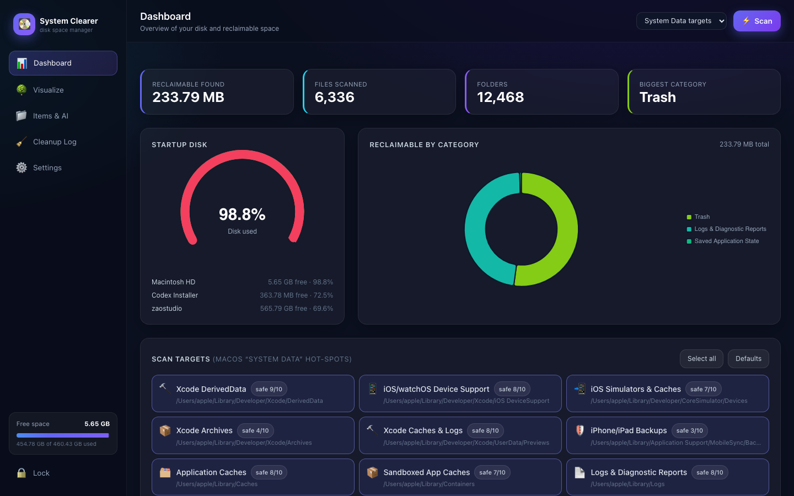
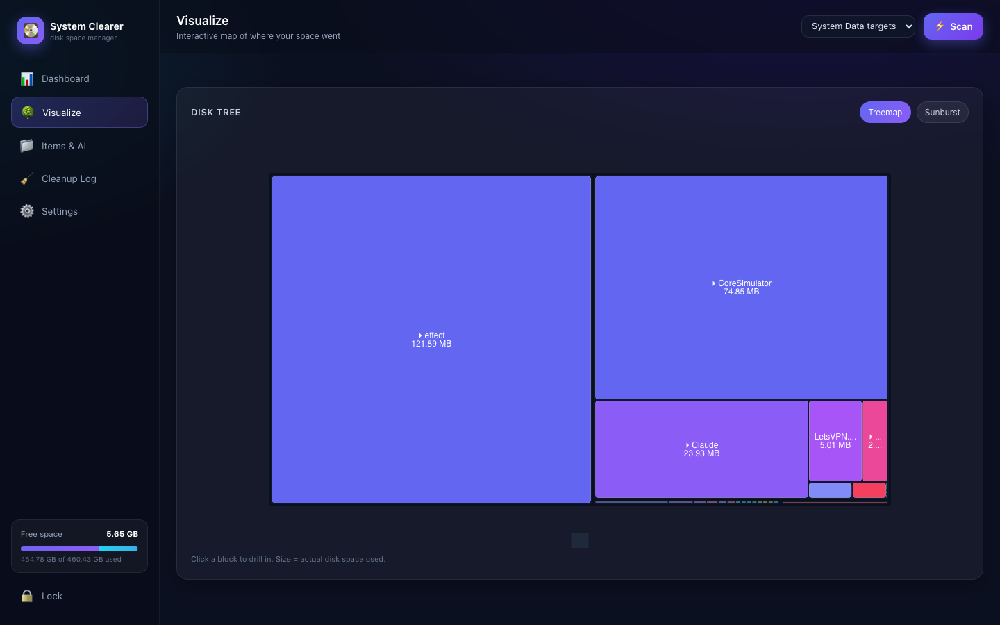
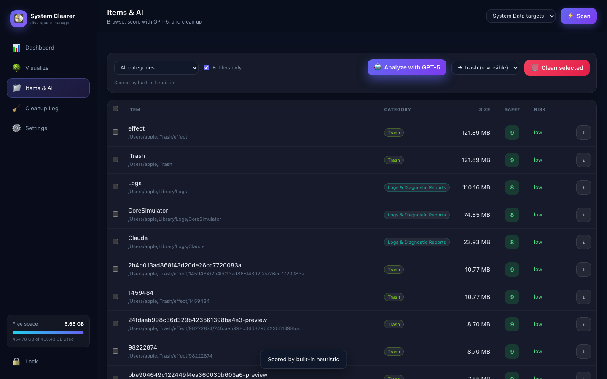

# 💽 Unfuck-your-mac-disk: macOS Disk Space Manager

A full-stack local app that hunts down the **deletable junk buried in macOS
"System Data"** — the opaque bucket traditional tools (and Finder) can't break
down — scores every item **1–10 for how safe it is to delete** (optionally with
**GPT‑5**), visualizes where your space went, and cleans it up **safely**.

Built for a Mac Studio whose internal disk was sitting at **98.8% full**.



| Treemap of the disk tree | Items scored 1–10 |
|---|---|
|  |  |

---

## What it does

1. **Scans the disk tree**, focusing on the hidden "System Data" hot‑spots:
   Xcode DerivedData / DeviceSupport / Archives, iOS Simulators, app & dev caches
   (npm/pip/yarn/CocoaPods/Gradle/Homebrew), iOS backups, logs, saved app state,
   Mail attachments, Docker data, Trash, VM swap — or **any custom folder**.
2. **Persists everything** to SQLite (scans, the file tree, AI verdicts, and a
   full deletion audit log) — your state and "memory".
3. **Explains & scores each item** — for every item you get a plain‑language
   *"what is this"* and a **1–10 deletability score** (10 = definitely safe).
   With an OpenAI key it uses **GPT‑5**; with no key it falls back to a built‑in
   heuristic so the app is always useful.
4. **Visualizes** with a disk‑usage gauge, a category **donut chart**, and an
   interactive **treemap / sunburst** of the tree.
5. **Cleans up safely**: move to **Trash** (reversible), **quarantine** (with
   one‑click **restore**), or **permanent** delete — all guarded by a
   protected‑path denylist that refuses `/System`, `/usr`, your home root, etc.
6. **Access management**: a local PIN gates the whole tool (it can delete files),
   with signed session tokens.

---

## Quick start

```bash
cd "system clearer"
./run.sh
```

Then open **http://127.0.0.1:9761** and create your access PIN.

> The Python virtual‑env is already created under `.venv`. `run.sh` will
> (re)create it automatically if missing. Dependencies are pinned in
> `requirements.txt`.

### Using GPT‑5
Open **Settings → OpenAI / GPT‑5**, paste your API key, keep the model as
`gpt-5` (or change it), and click **Test connection**. Then on **Items & AI**
press **Analyze with GPT‑5**. Without a key, scoring uses the built‑in heuristic.

---

## Typical workflow

1. **Dashboard** → pick scan targets (sensible defaults pre‑selected) → **Scan**.
2. Watch the gauge, donut and stat cards populate.
3. **Visualize** → drill into the treemap to see what's huge.
4. **Items & AI** → **Analyze with GPT‑5** → sort by size, read the score &
   recommendation → tick the safe ones → **Clean selected** (Trash by default).
5. **Cleanup Log** → review freed space, **restore** anything from quarantine,
   or **empty quarantine** to permanently reclaim it.

---

## Safety model

- **Protected‑path guard** (`backend/categories.py`) refuses deletion of system
  volumes, `/System`, `/usr`, `/bin`, SIP‑managed VM swap, your home/Library
  roots, and the app's own files.
- **Default = Trash** (reversible). **Quarantine** moves items into
  `data/quarantine/` and is restorable until you empty it. **Permanent** is the
  only irreversible option and always asks for confirmation.
- Every action is written to the `deletions` audit table.

---

## Architecture

```
backend/
  config.py        constants, data dir, default settings
  database.py      SQLite schema + helpers (settings, scans, nodes, analyses, deletions)
  auth.py          PIN (PBKDF2) + signed session tokens
  categories.py    macOS "System Data" catalog, classifier, heuristic scores, protected paths
  scanner.py       threaded disk walker (physical size via st_blocks), live progress, category attribution
  ai_analyzer.py   GPT‑5 batch analysis (JSON) + heuristic fallback, cached in DB
  cleaner.py       trash / quarantine / permanent delete + restore + guard
  main.py          FastAPI: REST API + static frontend
frontend/
  index.html       SPA shell (Tailwind + ECharts via CDN)
  css/styles.css   glassy dark theme
  js/app.js        all UI logic, charts, and API calls
```

**Stack:** Python 3.10 · FastAPI · Uvicorn · SQLite · OpenAI SDK · send2trash ·
ECharts · Tailwind. No build step for the frontend.

---

## API (all under `/api`, Bearer‑token auth except auth/health)

| Method | Path | Purpose |
|---|---|---|
| POST | `/auth/setup` · `/auth/login` · `/auth/change` | access management |
| GET  | `/disk` | per‑volume usage for the gauge |
| GET  | `/targets` · `/categories` | System Data catalog |
| POST | `/scan` · GET `/scan/status` · POST `/scan/cancel` | scanning |
| GET  | `/scan/{id}/summary` · `/tree` · `/treemap` · `/items` | results |
| POST | `/analyze` | GPT‑5 / heuristic scoring |
| POST | `/delete` · GET `/deletions` · POST `/deletions/{id}/restore` · `/quarantine/empty` | cleanup |
| GET/POST | `/settings` · POST `/settings/test-openai` | config |

---

## Notes
- The scanner reports **actual on‑disk size** (APFS block allocation), not just
  logical file size.
- Some locations need **Full Disk Access** to read fully; grant it to your
  terminal/Python in *System Settings → Privacy & Security → Full Disk Access*
  for the most complete scan.
- Data lives in `data/` (SQLite DB + quarantine). Delete `data/` to reset.
